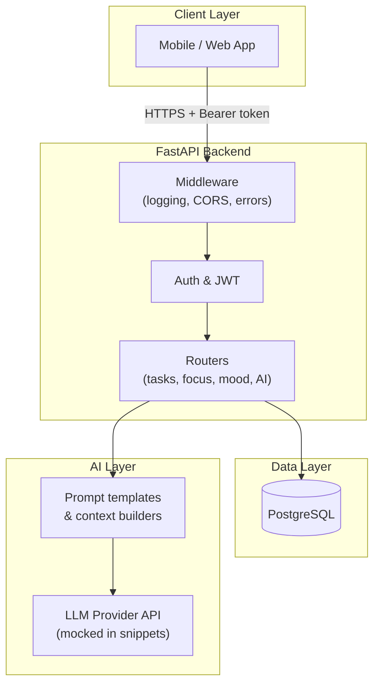

# MindTrack

**A Smart Task Organizer for University Students with ADHD — powered by AI**

[](https://www.python.org/)
[](https://fastapi.tiangolo.com/)
[](https://www.postgresql.org/)
[](https://github.com/)
[](LICENSE)

> **Portfolio documentation repository** — architecture, features, and curated backend highlights. Full application source is not published here.

---

## Overview

**MindTrack** is a graduation project that helps university students—especially those with **ADHD**—plan, break down, and complete academic work without cognitive overload. Instead of a flat to-do list, the app turns large assignments into **small, actionable steps**, supports **focus sessions**, and tracks **progress** with encouragement suited to executive-function challenges.

### Target audience

| Audience | Need addressed |
|----------|----------------|
| University students with ADHD | Overwhelm from big tasks, time blindness, difficulty starting |
| Neurotypical students (secondary) | Structured planning and accountability for heavy course loads |

Design principles reflected in the product: **short AI responses**, **one next step at a time**, **clear priorities from real deadlines**, and **non-punitive error messaging** when services are unavailable.

---

## Core features

- **AI task breakdown** — Natural-language tasks are decomposed into ordered subtasks via prompt-engineered workflows, with JSON validation and persistence.
- **Focus mode** — Timed focus sessions linked to tasks, with tracking for daily habits and gamification hooks.
- **Progress tracking** — Task/subtask completion, mood check-ins, badges, and streak-style engagement for sustained use.
- **Maya AI assistant** — Context-aware chat grounded in the user’s real schedule, deadlines, and reminders (Arabic-first, ADHD-friendly tone).
- **Rescue & reminders** — Proactive checks and smart reminder suggestions when workloads or overdue items pile up.
- **Security & middleware** — JWT authentication, structured exception handling, request logging, and CORS policies for a production-style API surface.

---

## System architecture

High-level flow from client to data and AI services:



### Repository layout (this docs repo)

```
mindtrack-docs/
├── README.md                 # Project overview (this file)
├── .gitignore
├── core_snippets/            # Curated, redacted backend highlights
│   ├── 01_request_logging_middleware.py
│   ├── 02_tasks_api_route.py
│   └── 03_ai_task_breakdown_service.py
├── docs/
│   └── architecture.md       # Extended architecture notes
└── assets/                   # Diagrams, screenshots (add as needed)
```

Copy [`.env.example`](.env.example) to `.env` locally when experimenting with snippets (never commit `.env`).

### Screenshots

_Add app screenshots to `assets/` and uncomment the lines below._

<!--


-->

---

## Tech stack

| Layer | Technologies |
|-------|----------------|
| **Runtime** | Python 3.11+ |
| **API** | FastAPI, Pydantic, Uvicorn |
| **Database** | PostgreSQL (production target); SQLite used in early prototype |
| **Auth** | JWT (access + refresh), salted password hashing |
| **AI** | Prompt engineering, structured JSON outputs, timeouts & graceful fallbacks |
| **Ops** | Environment-based config, structured logging, global exception handlers |

---

## My technical contributions as a Full-Stack Developer

This section summarizes **backend ownership** in MindTrack. Snippets in [`core_snippets/`](core_snippets/) illustrate patterns; they use **mock configuration** and contain **no secrets**.

### FastAPI backend APIs

- Designed a **modular router layout** (`/auth`, `/tasks`, `/ai`, `/focus`, `/gamification`, `/mood`, `/admin`) with consistent dependency injection for the current user.
- Implemented **lifespan hooks** for database initialization and health checks at startup.
- Built **REST endpoints** for CRUD on tasks/subtasks, profile settings, focus sessions, and admin operations with role-based access.
- Added **global `HTTPException` and catch-all handlers** so clients always receive predictable JSON error bodies.

### PostgreSQL database design

> **Note:** Portfolio snippets target **PostgreSQL**. The private graduation monorepo prototype uses **SQLite** (`database.py`) with the same relational model and migration pattern.

- Modeled **users, tasks, subtasks, sessions, reminders, mood entries, gamification, and AI interaction logs** with referential integrity.
- Used **versioned schema migrations** for non-destructive evolution (new columns, indexes, session tables) without data loss.
- Optimized common paths with **indexes on foreign keys** (e.g. `task_id` on subtasks) and WAL-friendly connection settings for concurrency.

### AI prompt workflows

- **Task chunking**: System prompts that enforce small steps, JSON-only responses, and post-processing/cleaning before DB insert.
- **Context injection**: Builders that serialize the user’s real tasks, deadlines, and reminders into Arabic structured context for the model.
- **Reliability**: Thread-pool timeouts, `asyncio.wait_for` on routes, friendly 503 messages for ADHD-appropriate UX when the model is busy or misconfigured.
- **Auditability**: Persisted `ai_interactions` rows for feature type, input snapshot, and parsed output for debugging and demos.

---

## Code highlights

| File | Demonstrates |
|------|----------------|
| [`core_snippets/01_request_logging_middleware.py`](core_snippets/01_request_logging_middleware.py) | ASGI middleware: request ID, latency logging, safe error surface |
| [`core_snippets/02_tasks_api_route.py`](core_snippets/02_tasks_api_route.py) | Typed FastAPI route, Pydantic models, DB dependency injection |
| [`core_snippets/03_ai_task_breakdown_service.py`](core_snippets/03_ai_task_breakdown_service.py) | AI service wrapper, prompts, timeouts, mocked API key |

---

## Privacy & publication notice

This repository is intended for **GitHub portfolio and academic review**:

- No production `.env`, API keys, or database dumps are included.
- Snippets are **representative** and may differ slightly from the private monorepo for clarity and redaction.

---

## Author

**Role:** Full-Stack Developer — MindTrack graduation project  
**Focus:** FastAPI services, PostgreSQL data model, AI integration, API security and middleware.

---

## License

Private graduation project. All rights reserved unless otherwise stated by the institution. Contact the author for collaboration or demo access inquiries.
