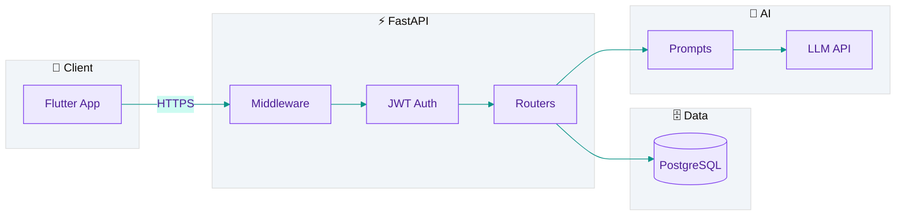

<p align="center">
  
</p>

<h1 align="center">MindTrack</h1>

<p align="center">
  <strong>A Smart Task Organizer for University Students with ADHD — powered by AI</strong>
</p>

<p align="center">
  <a href="https://github.com/raghadalb-tech/mindtrack-portfolio"></a>
  <a href="https://www.python.org/"></a>
  <a href="https://fastapi.tiangolo.com/"></a>
  <a href="https://www.postgresql.org/"></a>
  <a href="#"></a>
</p>

<p align="center">
  <a href="https://github.com/raghadalb-tech"></a>
  <!-- Replace YOUR_LINKEDIN_URL with your profile link for LinkedIn -->
  <a href="https://www.linkedin.com/in/YOUR_LINKEDIN_USERNAME"></a>
  <a href="LICENSE"></a>
</p>

<p align="center">
  <em>📂 Portfolio documentation — architecture, features & backend highlights · Full source not published</em>
</p>

<p align="center">
  <a href="#overview">Overview</a> •
  <a href="#core-features">Features</a> •
  <a href="#system-architecture">Architecture</a> •
  <a href="#tech-stack">Tech Stack</a> •
  <a href="#my-technical-contributions-as-a-full-stack-developer">My Work</a> •
  <a href="#code-highlights">Code</a>
</p>

---

## Overview

**MindTrack** is a graduation project that helps university students—especially those with **ADHD**—plan, break down, and complete academic work without cognitive overload.

Instead of a flat to-do list, the app turns large assignments into **small, actionable steps**, supports **focus sessions**, and tracks **progress** with encouragement suited to executive-function challenges.

<p align="center">
  
</p>

### Target audience

| | |
|:---:|:---|
| 🎯 **Primary** | University students with ADHD — overwhelm, time blindness, difficulty starting |
| 📚 **Secondary** | Neurotypical students needing structured planning for heavy course loads |

<table>
<tr>
<td width="50%" bgcolor="#ede9fe">

**Design for ADHD**

- Short AI responses  
- One next step at a time  
- Clear deadline priorities  

</td>
<td width="50%" bgcolor="#ccfbf1">

**Built for trust**

- Non-punitive errors when AI is busy  
- Real task context in prompts  
- Secure JWT-backed API  

</td>
</tr>
</table>

---

## Core features

<p align="center">
  
</p>

| Feature | What it does |
|---------|----------------|
| 🧠 **AI task breakdown** | Decomposes tasks into ordered subtasks via prompt-engineered workflows + JSON validation |
| ⏱️ **Focus mode** | Timed sessions linked to tasks, habit tracking, gamification hooks |
| 📊 **Progress tracking** | Tasks, subtasks, mood check-ins, badges & streaks |
| 💬 **Maya AI assistant** | Arabic-first coaching grounded in real schedule & deadlines |
| 🆘 **Rescue & reminders** | Proactive checks & smart reminder suggestions |
| 🔐 **Security layer** | JWT auth, middleware, structured exception handling, CORS |

---

## System architecture



<details>
<summary><strong>📁 Repository layout</strong></summary>

```
mindtrack-portfolio/
├── README.md
├── assets/              # Banners & illustrations (SVG)
├── core_snippets/       # Curated FastAPI highlights
├── docs/architecture.md
└── .env.example
```

</details>

---

## Tech stack

<p align="center">

| Layer | Stack |
|:------:|:------|
| ⚙️ **Runtime** | Python 3.11+ |
| 🚀 **API** | FastAPI · Pydantic · Uvicorn |
| 🗄️ **Database** | PostgreSQL *(target)* · SQLite *(prototype)* |
| 🔑 **Auth** | JWT access/refresh · salted password hashing |
| 🤖 **AI** | Prompt engineering · JSON outputs · timeouts & fallbacks |
| 🛡️ **Ops** | Env config · structured logging · global exception handlers |

</p>

---

## My technical contributions as a Full-Stack Developer

> Snippets in [`core_snippets/`](core_snippets/) use **mock config** — no API keys or secrets.

### FastAPI backend APIs

- **Modular routers** — `/auth` · `/tasks` · `/ai` · `/focus` · `/gamification` · `/mood` · `/admin`
- **Lifespan hooks** — DB init & health checks at startup
- **REST endpoints** — CRUD, profile, focus sessions, admin (role-based)
- **Error contract** — Global handlers → predictable JSON for clients

### PostgreSQL database design

> Portfolio snippets target **PostgreSQL**. Private prototype uses **SQLite** with the same relational model.

- Users, tasks, subtasks, sessions, reminders, mood, gamification, AI logs
- **Versioned migrations** — non-destructive schema evolution
- **Indexes** on foreign keys & WAL-friendly settings

### AI prompt workflows

- **Task chunking** — small steps, JSON-only, post-parse validation
- **Context injection** — real deadlines & reminders in Arabic context
- **Reliability** — thread timeouts, `asyncio.wait_for`, friendly 503 UX
- **Audit trail** — `ai_interactions` logging for demos & debugging

---

## Code highlights

| | File | Shows |
|:---:|:-----|:------|
| 🔧 | [`01_request_logging_middleware.py`](core_snippets/01_request_logging_middleware.py) | Request ID, latency logging, safe errors |
| 📋 | [`02_tasks_api_route.py`](core_snippets/02_tasks_api_route.py) | Pydantic models, DB injection, REST tasks |
| 🤖 | [`03_ai_task_breakdown_service.py`](core_snippets/03_ai_task_breakdown_service.py) | Prompts, JSON parse, timeouts, mock LLM |

---

## Share on LinkedIn

Copy this when posting your portfolio:

```
🎓 Graduation Project: MindTrack
A smart task organizer for university students with ADHD — powered by AI.

✅ FastAPI backend · PostgreSQL · AI prompt engineering
✅ Task breakdown · Focus mode · Progress tracking

🔗 Portfolio: https://github.com/raghadalb-tech/mindtrack-portfolio

#FullStack #FastAPI #Python #AI #ADHD #GraduationProject #SoftwareEngineering
```

> **Tip:** Replace `YOUR_LINKEDIN_USERNAME` in the LinkedIn badge above with your profile slug, then commit.

---

## Privacy notice

- No production `.env`, API keys, or database dumps
- Snippets are representative; redacted for public portfolio review

---

## Author

<p align="center">
  <strong>Raghad</strong> · Full-Stack Developer<br/>
  <sub>FastAPI · PostgreSQL · AI integration · API security</sub>
</p>

<p align="center">
  <a href="https://github.com/raghadalb-tech"></a>
</p>

---

<p align="center">
  <sub>Private graduation project · All rights reserved · <a href="LICENSE">License</a></sub>
</p>
